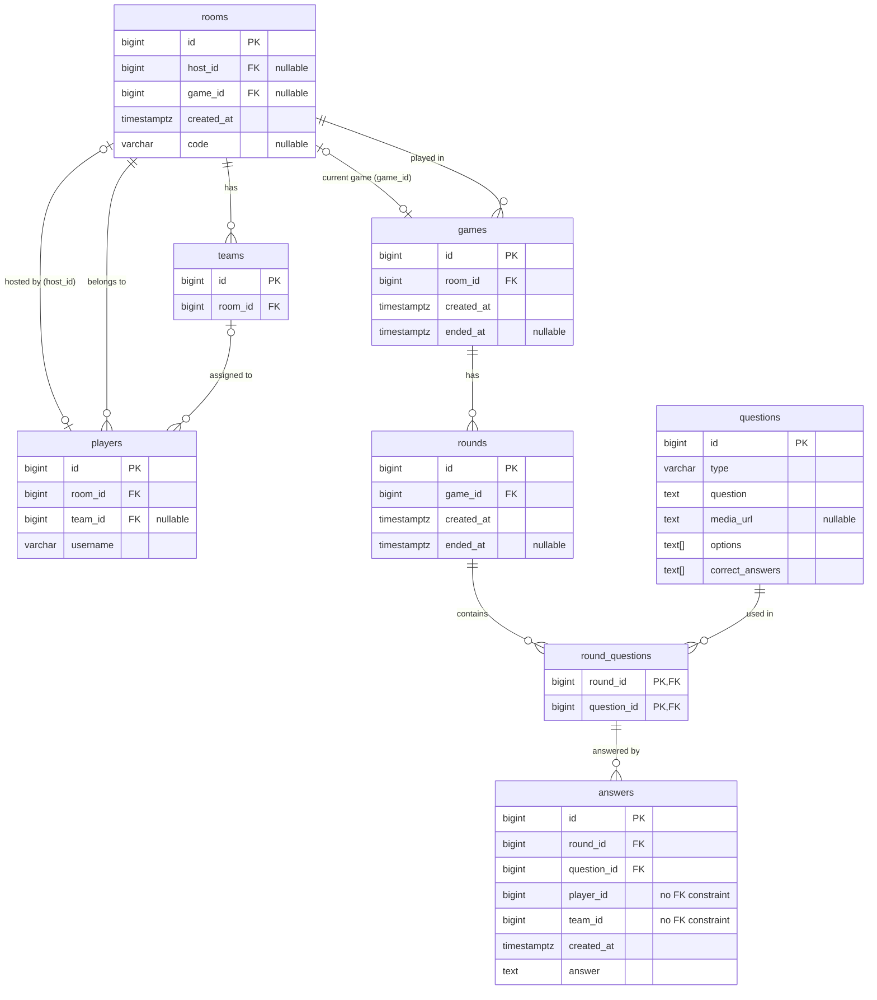

# trivia-api

A REST API for a multiplayer trivia game. Players create or join rooms (public or private with a code), form teams, and compete across rounds of questions. Each round presents multiple-choice, short-answer, or buzzer questions — optionally with media — and players submit answers before the round ends, when the correct answers and scores are revealed.
## Running

```bash
docker compose up
```

You can access the API at http://localhost:3000

## API

[Open OpenAPI spec in online SwaggerEditor](https://editor.swagger.io/?url=https://raw.githubusercontent.com/rtomrud/trivia-api/refs/heads/master/openapi.yml)

[openapi.yml](openapi.yml)

## Entity-Relationship Diagram



A player without a team assigned is in the room and can spectate the game but can't play (submit answers).

Answers reference a player (via player_id) and a team (via team_id) without foreign key constraints, so players and teams can be deleted without removing their answers, preserving the historical record of past games.

A room can only host one active game at a time, but games can be played sequentially in the same room.

## Functional requirements

- R01. A player can create a room. Each room has a unique and random URL that can be shared with other players.
- R02. A player can join a room, given the URL of that room. The player must specify a username when joining a room. The first player to join a room is the host of that room.
- R03. The host can create and delete teams. A player can join a team. The host can put any player into any team.
- R04. The host can create a game for the players in a room.
- R05. The host can configure the rounds, time per round and questions per round of a game.
- R06. When a round of a game starts, a players can see the questions of that round. A question can be either: Multiple Choice (N options to chose from), Short Answer (open-ended reply) or Buzzer (only the first correct answer scores). A question has text and may also have media (audio or video).
- R07. A player can answer a question until the round ends, and they must not be able to know whether the answer is correct until the end of the round.
- R08. After a round ends, a player can see the correct answers of each question of that round.
- R09. After a round ends, a player can see the answer of each player to each question of that round.
- R10. A player can see the score (based on the amount of correct answers) earned by each player and team.

