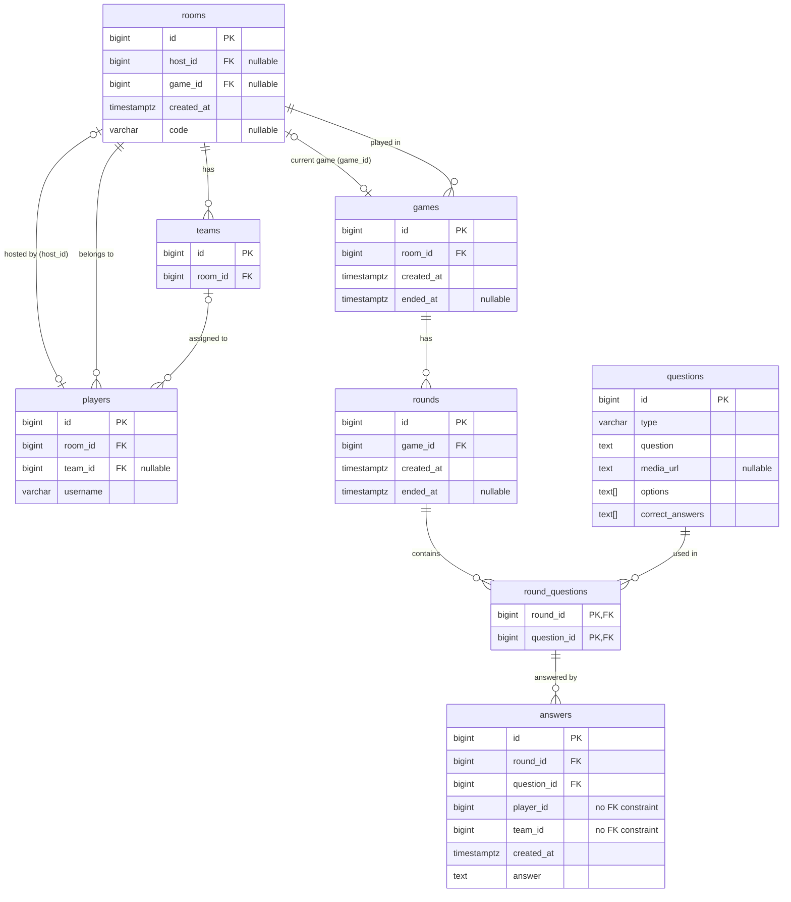

# trivia-api

A REST API for a multiplayer trivia game. Players create or join rooms (public, or private with a code), form teams, and compete across rounds of questions. Each round presents one or many questions and players submit answers before the round ends, when the correct answers are revealed.

## Running

```bash
docker compose up
```

You can access the API at http://localhost:3000

## API

[Open OpenAPI spec in online SwaggerEditor](https://editor.swagger.io/?url=https://raw.githubusercontent.com/rtomrud/trivia-api/refs/heads/master/openapi.yml)

[openapi.yml](openapi.yml)

## Entity-Relationship Diagram



A player without a team assigned is in the room and can spectate the game but can't play (submit answers).

Answers reference a player (via player_id) and a team (via team_id) without foreign key constraints, so players and teams can be deleted without removing their answers, preserving the historical record of past games.

A room can only host one active game at a time, but games can be played sequentially in the same room.

## Functional requirements

- R01. A player can create a room to host games.
- R02. A player can share the unique URL of a room so that other players can join the room.
- R03. A room can be made private by setting a code, so that only players that know the code can join it. A room without a code is public and anyone can join it.
- R04. A player can join a room, given the URL and code of that room. The player must specify a username when joining a room.
- R05. A player that joins an empty room (the first player to join) becomes the host of that room.
- R06. A player can see a list of the public rooms (rooms withou a code).
- R07. A host can delete the room, unless a game is being played in the room.
- R08. A host can create a team in the room.
- R09. A host can delete a team in the room.
- R10. A host can assign any player to a team, unless a game is being played in the room.
- R11. A host can remove any player from a team, unless a game is being played in the room.
- R12. A player can join a team, unless a game is being played in the room.
- R13. A player can leave a team, unless a game is being played in the room.
- R14. A host can create a game for the players in a room and must configure the amount of rounds, the time per round and the questions per round of that game.
- R15. A player without a team can watch the game but cannot play.
- R16. A player can see the questions of a round once the round starts.
- R17. A question has a type, such as multiple-choice or short answer, may have media (audio or video), and has one or many correct answers.
- R18. A player can answer the round's questions until the round ends.
- R19. A player can see the correct answers of each question of that round once the round ends.
- R20. A player can see the answer submitted by every player to each question of that round once the round ends.

